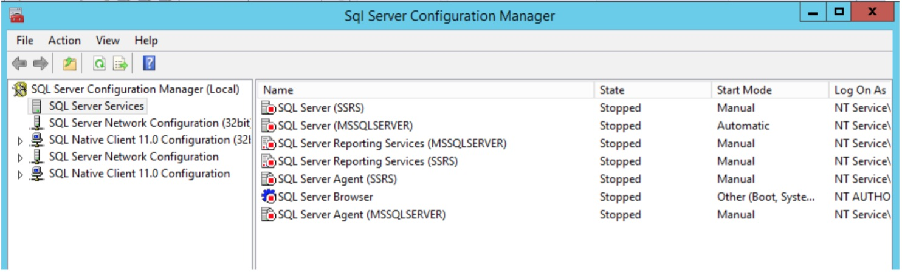
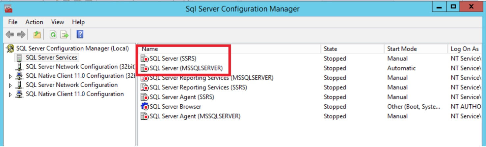
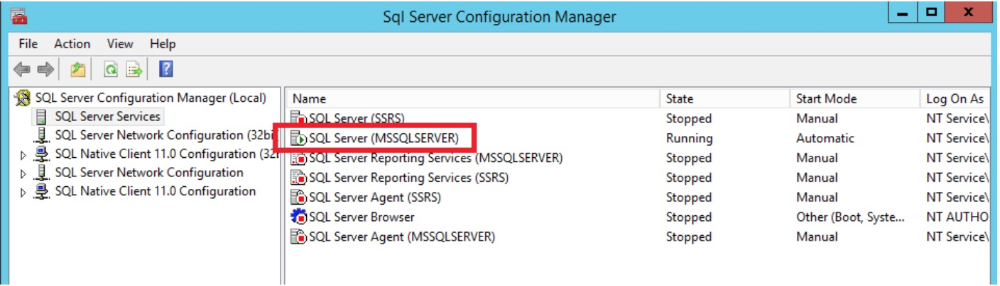
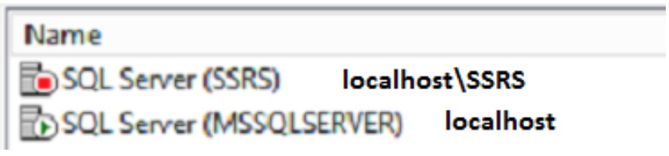
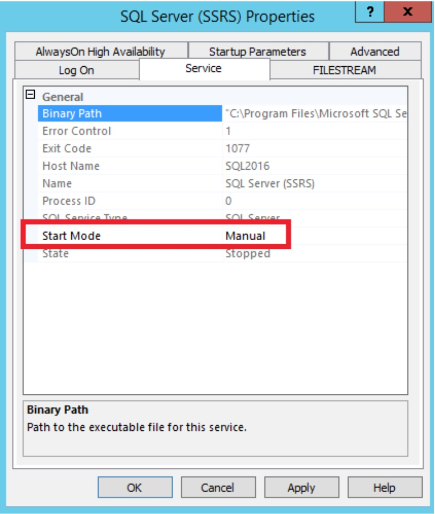

# Connection Issues

## Cannot connect to SQL Server
 You receive an error message that states that you cannot connect to localhost.

### Review Configuration Properties
1. Search for a program called **SQL Server 2016 Configuration Manager**. You may want to pin this program to your taskbar.

2. If you are asked if it is OK for this program to change settings on your computer, say OK.
3. Click **SQL Server Services** to view the services installed. In my case, they are all shut down.

4. Find the service called **SQL Server (instance name)** in the list. I have two SQL Server instances. You will probably have just one.

5. Notice the names in the parentheses. These are the instance names. When you see MSSQLSERVER, that means the default instance. Anything else if a named instance. If you have a named instance, you will need that information when you connect.

### Start the Server
1. Right-click on the service and select **Start**.

2. Once the SQL Server starts up, you should see the red square turn into a green arrow.

### Determine the Connection Name
1. To connect to your SQL Server, you need to know the name. For a locally installed instance, you can use one of these instead of the computer name: **localhost**, **(local)**, or . .
2. If you have a named instance, you will need to follow the computer name with a backslash and the instance name.

### Try Connecting Again
1. To connect to SQL Server, launch **SQL Server Management Studio** (SSMS). Make sure that **Database Engine** and **Windows Authentication** are selected.

### Don't Click ``<Browse for More...>``
1. Avoid clicking this option. It will try to browse for networks to find SQL Servers. It could take a long time.

### Change start up properties
1. If you are concerned that SQL Server takes too many resources when you don’t need it, you can change the properties so that it just runs when you need it.
2. Open the **SQL Server Configuration Manager**. Right-click on the service that you don’t want to start up automatically and select **Properties**.

3. On the **Service** tab, change the **Start Mode** to **Manual**.

4. When you want to run SQL Server, you’ll have to launch **Configuration Manager** to start up the service.
