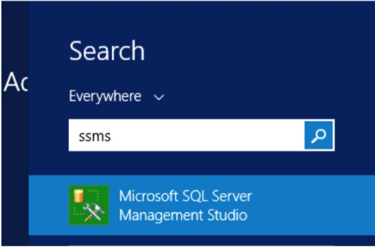
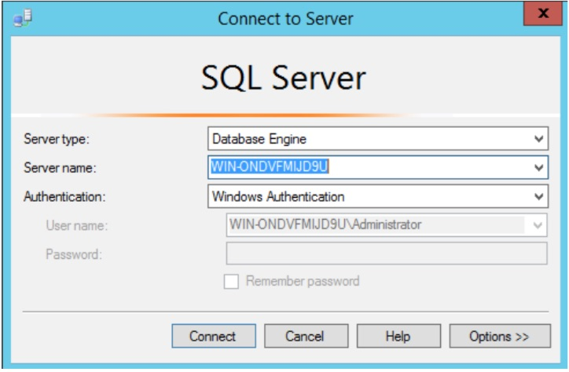
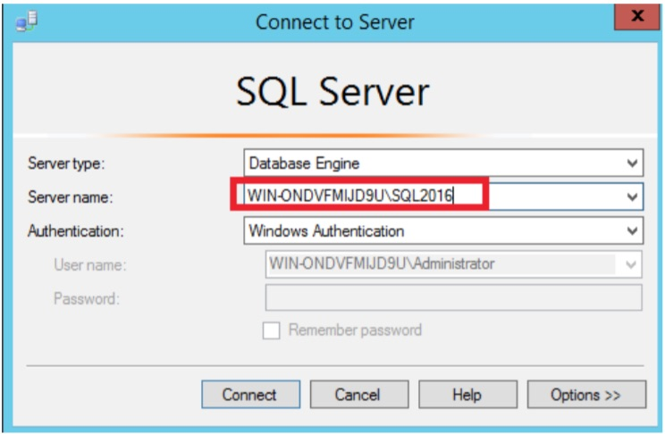
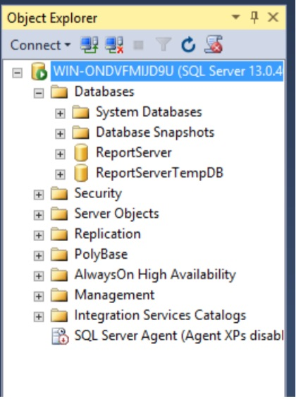
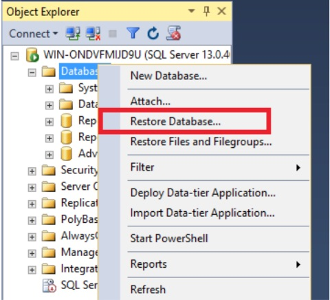
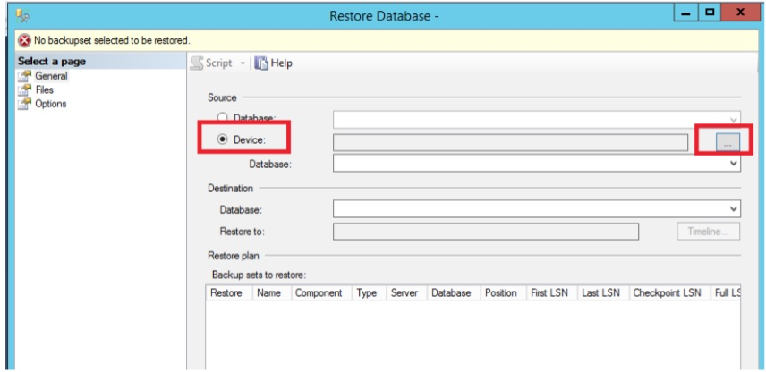
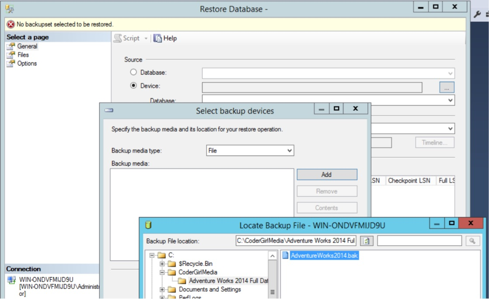
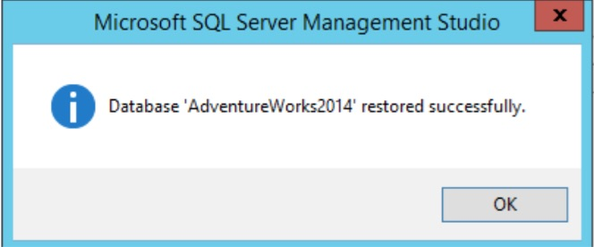
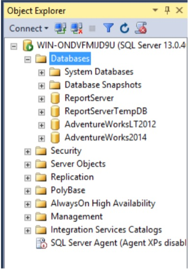

# How to Restore a Database

These instructions cover how to restore a .BAK file to a SQL Server. NOTE: A file from a later version of SQL Server cannot be restored on an earlier version.

## Extract a ZIP file
If the backup file happens to be compressed, you will need to uncompress it first. Right-click on the zip file and select Extract All.

## Launch SSMS
SSMS (SQL Server Management Studio) will be the main tool you will use in this course. Find it by typing SSMS in the Search window. It’s a great idea to pin SSMS to the taskbar so you can find it more easily later.

## Connect to Your SQL Server Instance
1. Connect to the instance of SQL Server that you installed. Usually this will be LOCALHOST. Make sure that Windows Authentication is selected. Click Connect.

2. If you have installed a named instance, you will need to supply the instance name after a backslash.

3. The Object Explorer will open on the left.

## Performing the Restore
1. Make a note of the location of the backup (BAK) file.
2. In Object Explorer, right-click on Databases and select Restore Database.

3. This opens the Restore Database dialog. Select Device and click the ellipsis.

4. This pops up the Select backup devices dialog. Click Add and navigate to the bak file.

5. Select the file.
6. Click OK three times to kick off the restore.
7. Click OK to dismiss the dialog once the restore is complete.

8. You should now see the new database in the Object Explorer.

