# SQL Server Installation

## Installation of SQL Server 2016 Developer Edition
These instructions are meant for learning SQL Server, not for a production installation.
1. This version is available for free when you sign up for Visual Studio Dev Essentials. Once signed up for Dev Essentials, download SQL Server 2016 Dev Edition. There is also a version with Service Pack 1. I had problems getting the file to work, so I recommend starting with the original and applying SP1 as a second step.
2. The SQL Server Developer Edition file is an ISO file. Double-click the file top open it. Double-click the Setup Icon.

3. The SQL Server Installation Center opens. You can click the Hardware and Software Requirements link to make sure that your system will support SQL Server 2016.
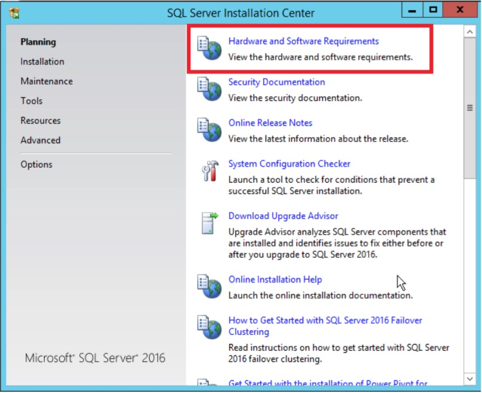
4. Click Installation on the left and then click New SQL Server stand-alone installation or add features to an existing installation.
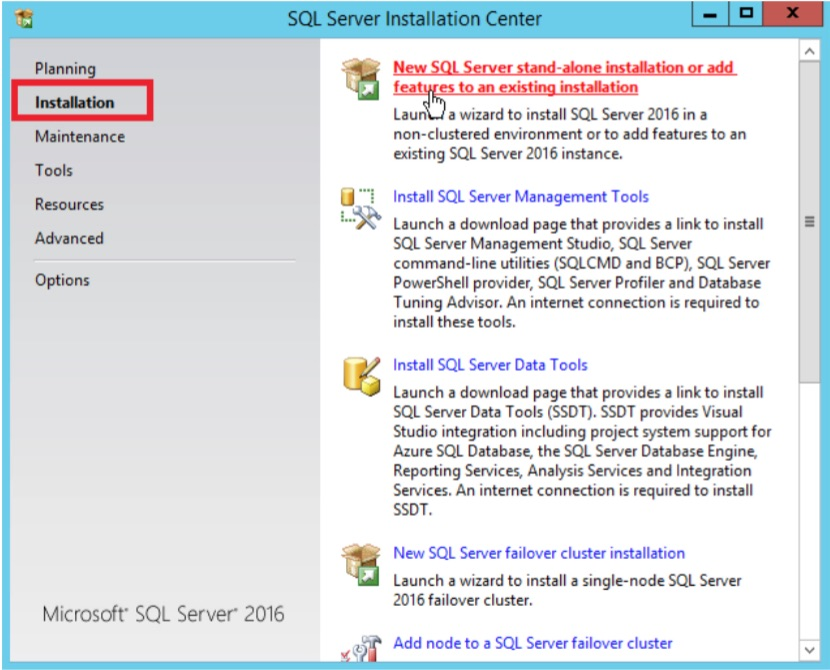
5. This will kick off the installation wizard. On the Product Key page, make sure that Developer edition is selected and click Next.
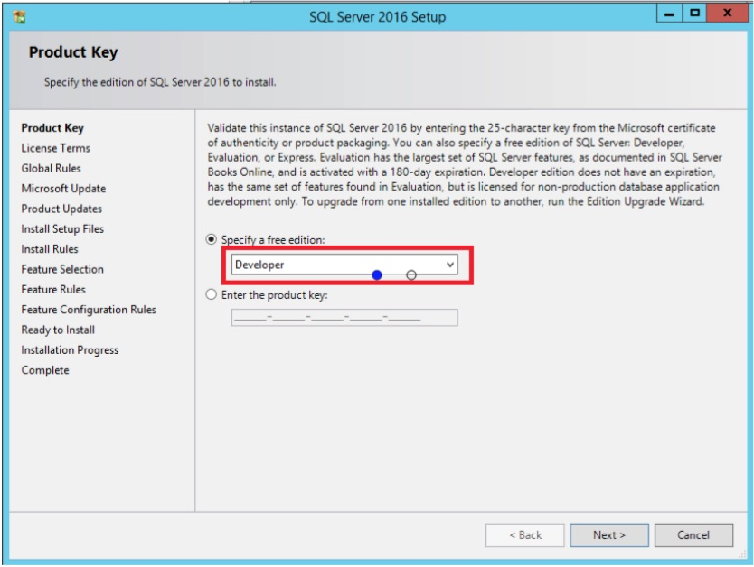
6. On the License Terms page, select I accept the license terms and click next.
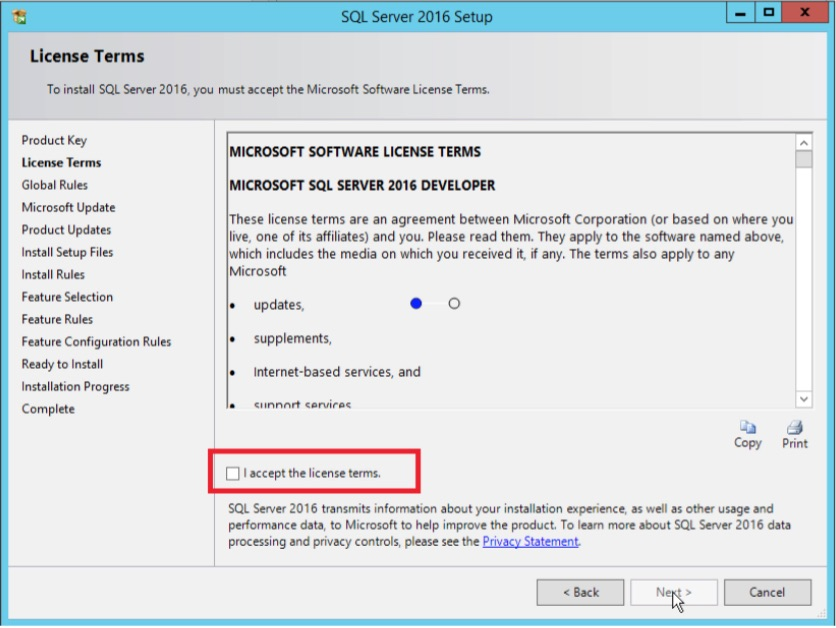
7. On the Microsoft Update page, check Use Microsoft Update to check for updates (recommended) if you want updates to be applied automatically and click Next.

8. On the Product Updates page, select Include SQL Server product updates and allow any critical updates to be applied. Click Next when done.
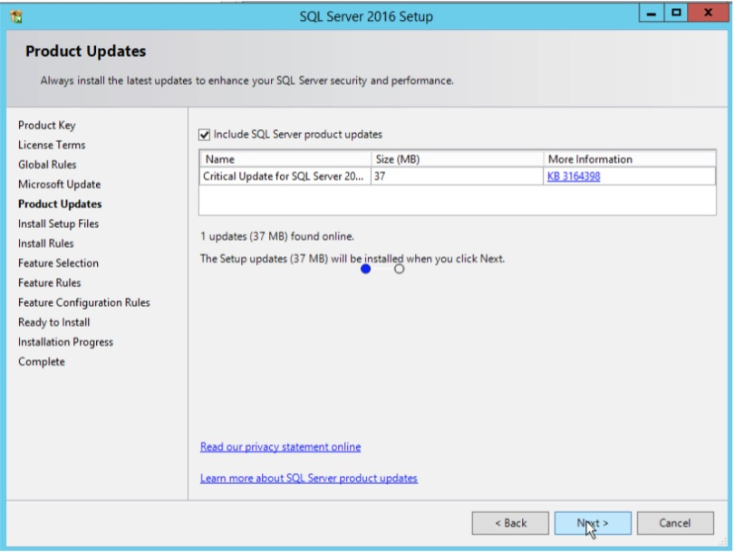
9. On the Feature Selection page, check Database Engine Services and Reporting Services – Native. If there are other features that you are interested in, such as Full Text, you may want to select those as well. Click Next.

10. On the Instance Configuration, you will provide an instance name. This is required when multiple instances of SQL Server are installed. MSSQLSERVER is the default. If this must be a named instance, write down the instance name.

11. On the Server Configuration page, select Grant Perform Volume Maintenance Task privilege to SQL Server Database Engine Service and click Next.

12. On the Database Engine Configuration page, click Add Current User to add your account to the SQL Server as an administrator. Change to Mixed Mode and fill in a password. Click Next.

13. Make sure that Install and Configure is selected and click Next.

14. On the Ready to Install page, click Install.

15. Once the installation is complete, restart if necessary.

## Installation of Service Pack 1
The service pack is required for fixes and new features. Install Service Pack 1 if the original media did not come with it.
1. Download the [service pack](https://www.microsoft.com/en-us/download) file.
2. Double-click the file.

3. Wait while the files extract and the installation wizard kicks off.

4. On the License Terms page, check I accept the license terms and click Next.

5. On the Select Features page, make sure everything is selected and click Next.

6. Click through the rest of the wizard. Restart if required.

## Install SQL Server Management Studio
SQL Server Management Studio (SSMS) is used to manage SQL Server and provides a place to write queries. In previous versions, SSMS was installed with SQL Server. In order for Microsoft to provide frequent updates, it is now a separate download. You can find the link from the SQL Server media.
1. Launch the SQL Server Installation Center by double-clicking Setup in the SQL Server installation media.
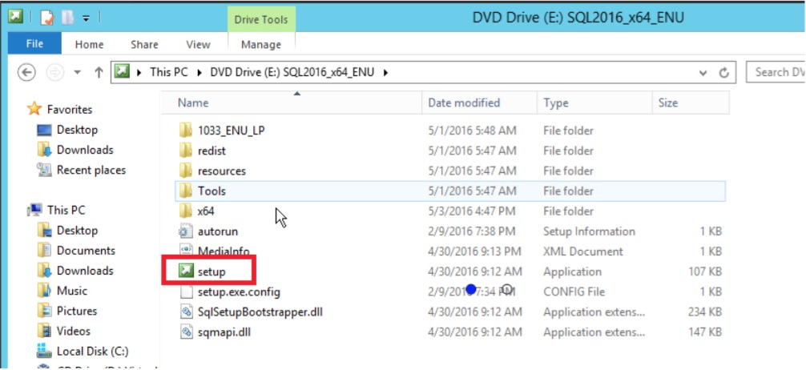
2. On the Installation page, click Install SQL Server Management Tools.
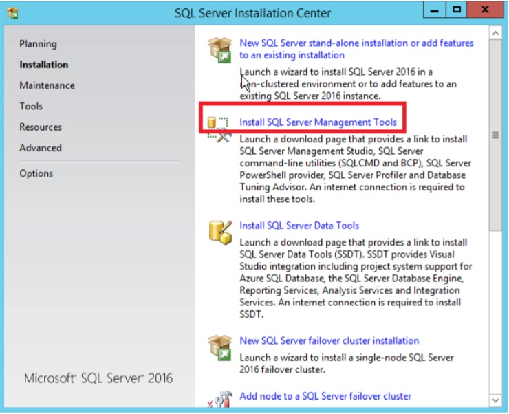
3. This will launch a page where you can download the latest SSMS file.
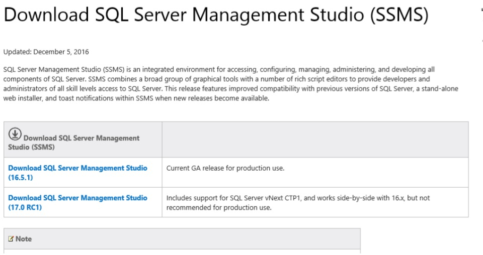
4. Double-click the file to launch the installation.
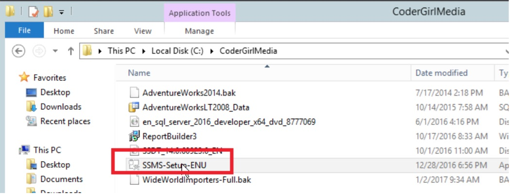
5. Click Install.
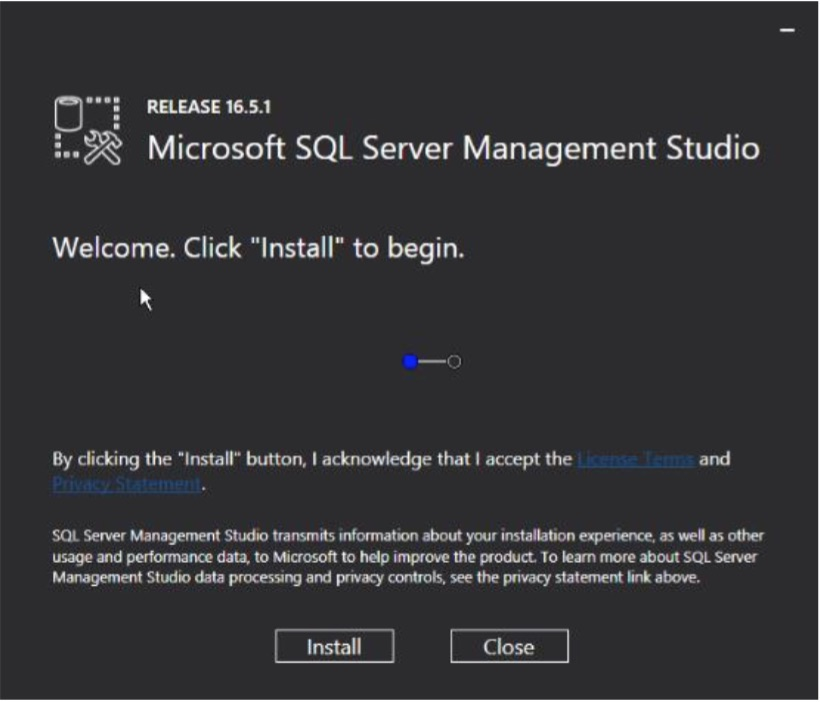
6. Restart if required.

## Attach AdventureWorksLT database
This database is used in the EdX course. The available file is an MDF file, which is an actual database file. It will be attached to the SQL Server, not restored.
1. Download the [AdventureWorks2012LT database file](https://github.com/Microsoft/sql-server-samples/releases/tag/adventureworks).
2. Copy the file to this location `C:\Program Files\Microsoft SQL
Server\MSSQL13.MSSQLSERVER\MSSQL\DATA` . If you have a named instance, the path will be slightly different. Replace MSSQLSERVER with the instance name.
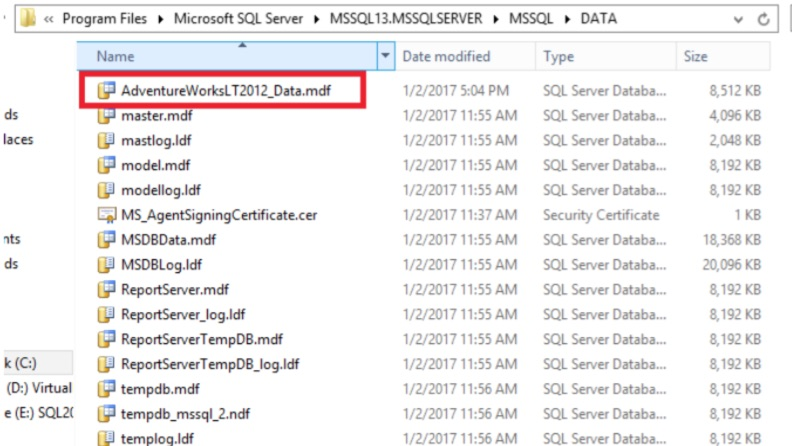
3. Locate SQL Server Management Studio and run it. You will probably want to create a shortcut in the taskbar or desktop because you will be using this program often.
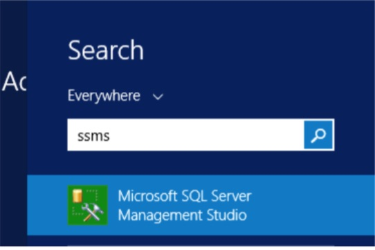
4. Connect to the instance of SQL Server that you installed and click Connect.
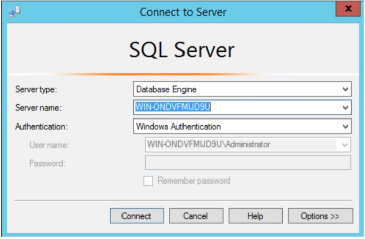
5. If you have installed a named instance, you will need to supply the instance name after a backslash.
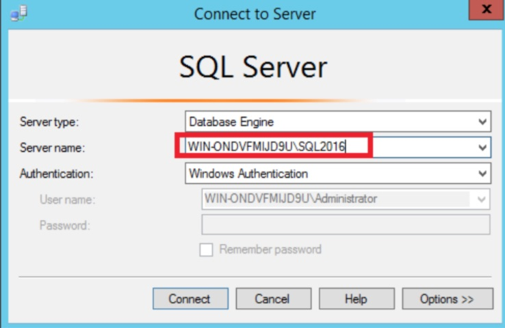
6. The Object Explorer will open on the left. Expand Databases.
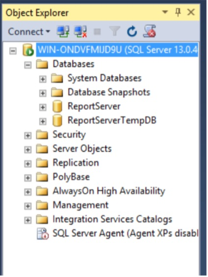
7. Right-click Databases and select Attach...
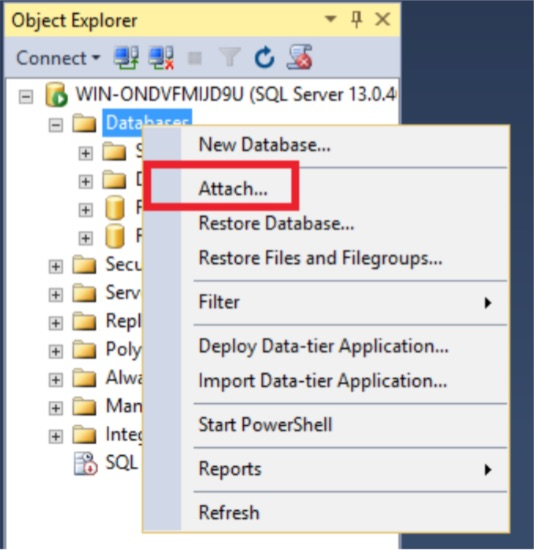
8. Click Add on the Attach Databases dialog.
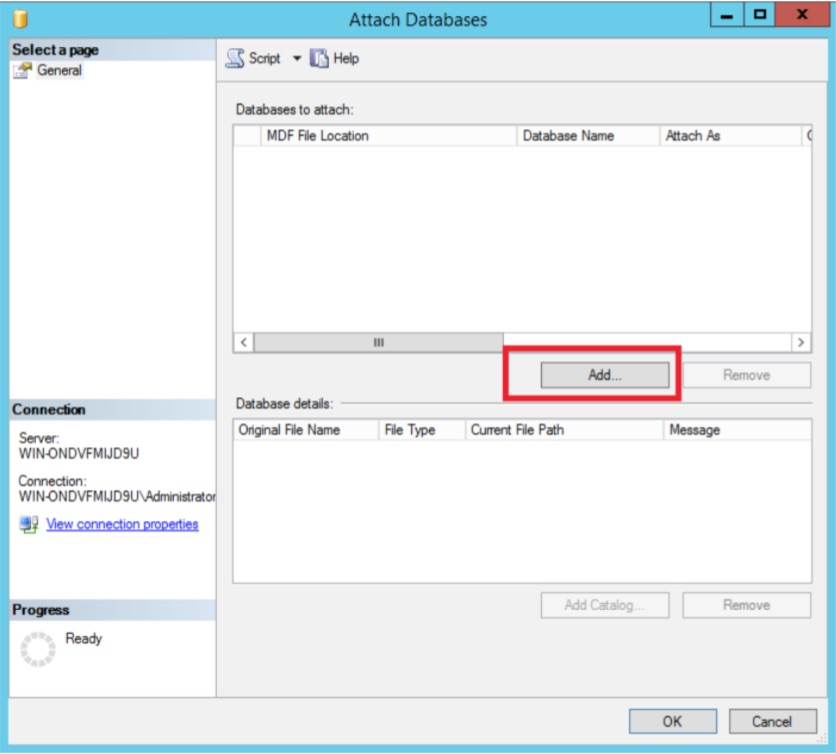
9. Select the AdventureWorksLT2012_Data.mdf file and click OK.
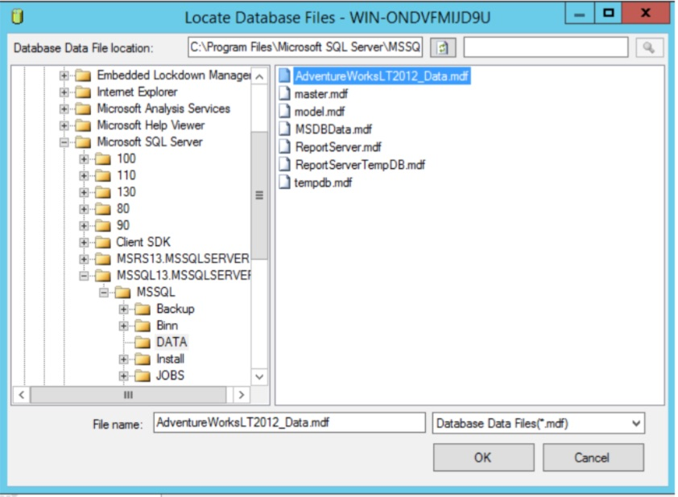
10. Click OK on the Attach Databases dialog. You should see the new database in the Object Explorer window.
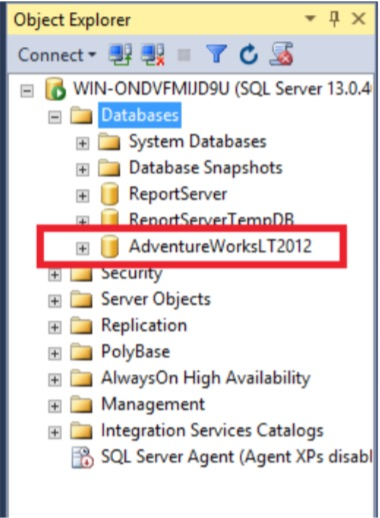

## Restore the AdventureWorks2014 database.
This database is used in the auntkathisql.com exercises as well as many examples and books. It can be downloaded as a backup file which must be restored.
1. Download the [AdventureWorks 2014 Full DatbaseBackup.zip file](https://github.com/Microsoft/sql-server-samples/releases/tag/adventureworks).
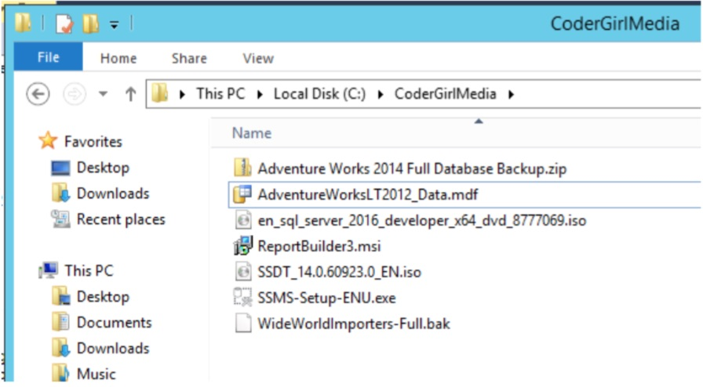
2. Extract the file by right-clicking and selecting Extract All.
3. Launch SSMS and connect to your SQL Server.
4. Right-click on Databases and select Restore Database.

5. This opens the Restore Database dialog. Select Device and click the ellipsis.

6. This pops up the Select backup devices dialog. Click Add and navigate to the bak file.

7. Click OK three times to select the files and kick off the restore.
8. Click OK to dismiss the dialog once the restore is complete.
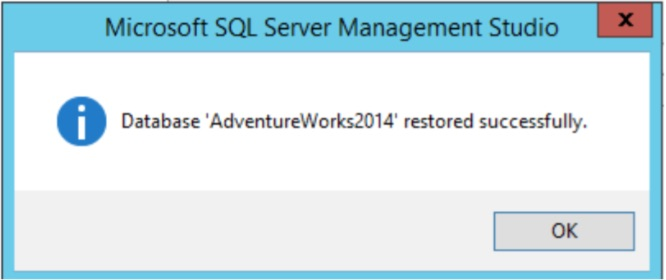
9. You should now see the new database in the Object Explorer.
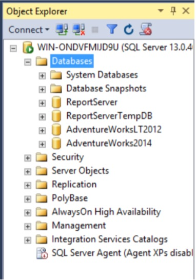

## Restore the Northwind Database
This is the new sample database. It will be used in some of the homework assignments.
1. Download the [backup file](https://www.microsoft.com/en-us/download/details.aspx?id=23654).
2. Except for unzipping, follow the instructions in the Restore AdventureWorks2014 database
section.

## Installing SQL Server Data Tools
SSDT will be used in the Reporting Services portion of the class.
1. Launch the SQL Server Installation Center by double-clicking Setup in the SQL Server installation media.

2. On the Installation page, click Install SQL Server Data Tools.
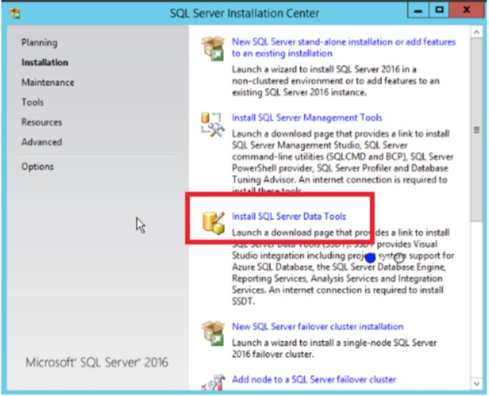
3. This will take you to a download page where you can get the latest version.
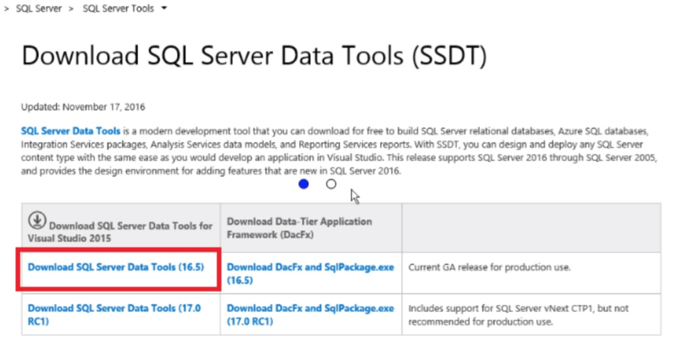
4. Double-click the file.

5. Double-click SSDTSETUP.EXE to launch the installation.

6. In this class, we will be working with Reporting Services, but not Analysis Services or Integration Services. You can uncheck those boxes and click Next.

7. Agree to terms and conditions and click Next.
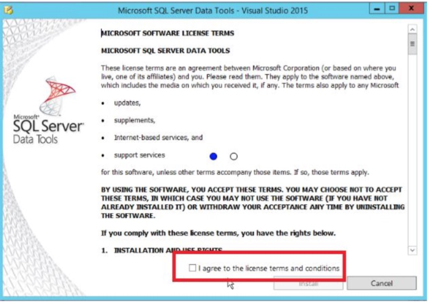
8. Restart after the installation if required.
